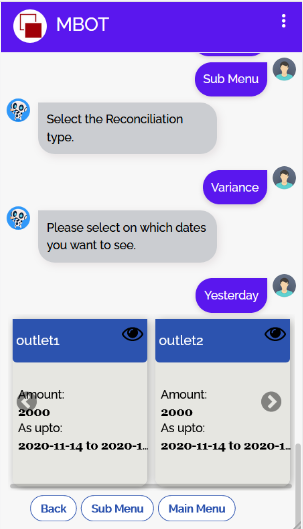
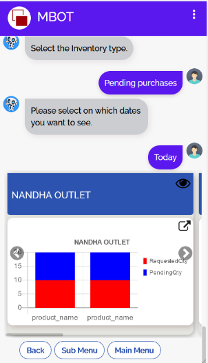
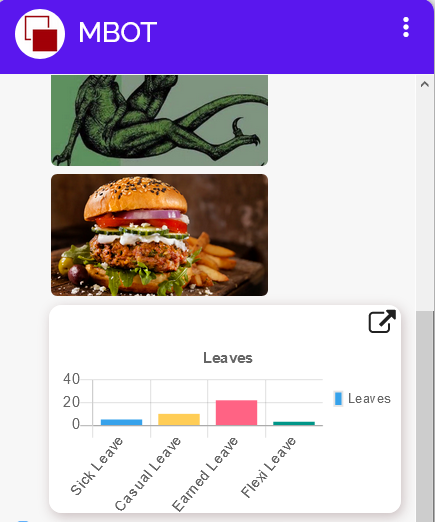

# MBOT
[](https:forthebadge.com)
[](https:forthebadge.com)
[](https://forthebadge.com)

[](https://forthebadge.com)
[](https://forthebadge.com)

[](https://forthebadge.com)
[](https://forthebadge.com/images/badges/for-robots.svg)
### Documentation for the ChatBot

# Table Of Contents

1. [Installation](#installation)
2. [Run server](#run-server)
3. [How it works?](#how-it-works)
4. [Payloads Supported By Bot](#payloads-supported-by-bot)

## Installation

1. Clone this repo
2. Open working directory of this project
3. Install Nodejs >=v12.0
4. Run Below command

```
$ npm i
```
5. To Setup Data API for this bot add API_BASE_URL in the .env.
## Run Server

_For the Development environment,it uses nodemon to auto run server on save._

```
$ npm run devStart
```

_For the production just run this._

```
$ npm start
```

Server is up and running on port provided in the **.env** file.

## How it works?
<p style="color:green">This bot does not understands any words just a button based bot,
According to the Bot requirements it was built.
But this architecture can be extended for user typing also,
I have added typing keyboard in UI and connected with it javascript also, so that typed message will be send to the server.
As currently typing feature is not necessary so commented its code in index.html,
Typing feature requires NLP intent classification ,previously I have implemented it using  
<a href="https://www.npmjs.com/package/node-nlp">node-nlp</a> module, later removed it and built dialog-management without nlp.
</p>
<h3>Dialog-management</h3>
<p style="color:black;font-size:1.15rem;">
<ol>
<li>
<h4 style="color:orange">User Clicks Button</h4>
<p>Whenever user clicks a button the data-payload as "/intentname" will be sent to server,<br>
<strong>eg: /main.sales.consolidated.today</strong> here this intent speaks about itself that under the main go to consolidated sales of today.
</p>
</li>

<li>
<h4 style="color:orange">Responding to the intent</h4>
<p>In server that particular intent received will be first checked in the actions,if it is their and it will execute that action folder by recursively loading all modules in that folder.<br>
If their is no action then it will check it in the responses.js
And execute that response.
<h4><u>What are actions & responses?</u></h4>
Actions are the dynamic responses such as querying DB or API and sending that response.
Where as the responses are the static responses.
<strong>eg: "/greetings.welcome" is a static welcome message with some buttons,
"/main.sales" with some static options,
"/main.sales.consolidated" with some static options like today,yesterday..,</strong>
</p>
</li>
</ol>
</p>


# Payloads Supported By Bot

## Text
- Sending Text Response


```
    message = [{
        text:"Welcome to bot"
    }]
```
## Image
- Sending Image Response


```
    message = [{
        text:"Checkout the image below",
        image:"<link-to-image>"
    }]
```
## Buttons
- Sending Buttons Response


```
    message = [{
        buttons:[
            {
                title:"Sales",
                payload:"/main.sales"
            },
            {
                title:"Reconciliation",
                payload:"/main.recon"
            },
        ]
    }]
```
## simpleCardCarousels
- simpleCard with metadata and table
```
custom:{
payload:"simpleCardCarousel",
data: array_of_cards
}
card may contain only metadata or only table and both metadata and table.
refer response example below.
```
card with only two metadata and table preview button


card with more than 2 metadata


card metadata preview button on clicking


card table view on clicking preview button

```
    message = [
        {
            text:"Total sales: 1000, Total cost:4000Rs",
             {
                 "custom":{
                     "payload":"simpleCardsCarousel",
                     "data":[{
                     "table":{
                         "tableData":[{
                             id:1,
                             name:"Shampoo",
                             price:80,
                             qty:1
                         },
                         {
                             id:2,
                             name:"Meera",
                             price:30.454,
                             qty:2
                         }],
                         "columns":[{
                             title:"Name",
                             field:"name"
                         },{
                             title:"Price",
                             field:"price",
                             sorter:"number"
                         },
                         {
                             title:"Quantity",
                             field:"qty",
                             sorter:"number"
                         }],
                         "initialSort":[{column:"name", dir:"asc"}]
                     },
                     "metadata":{
                         title:"Nandha Outlet",
                         data:[
                            {title:"Sales",value:"1000"},
                            {title:"PONO",value:"xxxxxxx"}]
                     }
                     },
                     ]
                 }
             }]
        },
        {

        }
    ]
```

## graphCardCarousel
- graphCardCarousel with metadata and graph

card with metadata and graph


card with graph preview


``` 
message = [
            {
                "text":"Displaying card with Graph",
                "custom":{
                    "payload":"graphCardsCarousel",
                    "outlets":[
                    {
                    "metadata":{
                        title:"Nandha Outlet",
                        data:[{title:"val1",value:"bbbbabab"},
                        {title:"va2",value:"bbbbabab"},
                        {title:"val3",value:"bbbbbbbabab"}]
                    },
                    "label1":"Label1.",
                    "label2":"Label2.",
                    "chartsIntersectData":[2, 4, 12, 9],
             "title": "Nandha Outlet", "labels": ["Sick Leave", "Casual Leave", "Earned Leave", "Flexi Leave"], "backgroundColor": ["#36a2eb", "#ffcd56", "#ff6384", "#009688", "#c45850"], "chartsData": [5, 10, 22, 3], "chartType": "bar", "displayLegend": "true"              
                    },
                    ]
                }
            }
]
```

## QuickReplies
- quickReplies are the buttons which scrolls horizontally


```
message = [{
        custom:{
            payload:"quickReplies",
            data:[
            {
                title:"Sales",
                payload:"/main.sales"
            },
            {
                title:"Reconciliation",
                payload:"/main.recon"
            },
        ]
        }
    }]
```

## chart
- single chart display

single chart


single chart preview


```
message = [{
    custom:{
        payload:"chart",
"data":{ "title": "Leaves", "labels": ["Sick Leave", "Casual Leave", "Earned Leave", "Flexi Leave"], "backgroundColor": ["#36a2eb", "#ffcd56", "#ff6384", "#009688", "#c45850"], "chartsData": [5, 10, 22, 3], "chartType": "bar", "displayLegend": "true" }
    }
}]
```

## loginform
- trigger login form

loginform


```
message = [{
    custom:{
        payload:"loginform"
    }
}]
```

_Also ui supports video, and other features also_


